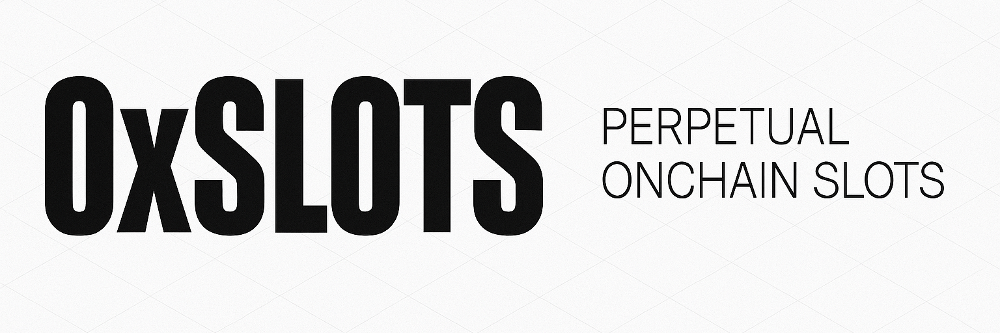

# 0xSlots



**Perpetual Onchain Slots** — Harberger tax mechanics on Ethereum with Superfluid streaming.

Every slot has a price. Holders self-assess and pay continuous tax. Anyone can buy any slot at the posted price. Resources flow to whoever values them most.

## How it works

1. **Self-assessment** — Slot holders set their own price
2. **Continuous tax** — Pay tax proportional to your price via [Superfluid](https://superfluid.finance) streams
3. **Always for sale** — Anyone can buy at the posted price, instantly
4. **No squatting** — Holding costs money, so only active users hold slots

## Architecture

```
Layer 1: Slot Primitive
├── Harberger.sol          — ERC-721 slots with self-assessed pricing
├── HarbergerHub.sol       — Factory & governance (UUPS upgradeable)
└── HarbergerStreamSuperApp.sol — Superfluid tax streaming

Layer 2: Modules
├── IHarbergerModule       — Interface for pluggable modules
├── MetadataModule          — Content/metadata for slots
└── Your Module             — Build anything on top
```

## Use cases

- **Onchain ads** — Ad slots priced by the market, not ad networks
- **AI agent resources** — Compute, API access, bandwidth allocation
- **Domain names** — Prevent squatting through continuous cost
- **Protocol positions** — Validator slots, oracle seats, governance
- **Digital real estate** — Virtual land, metaverse plots
- **Spectrum & bandwidth** — Scarce network resource allocation

## Monorepo

```
apps/
  landing/    — Website (Next.js 15)
  contracts/  — Solidity contracts (Foundry)
```

## Development

```bash
pnpm install

# Landing page
pnpm --filter landing dev

# Contracts
cd apps/contracts
forge install
forge build
forge test
```

## MCP Server

An [MCP](https://modelcontextprotocol.io) server for AI agents to interact with the protocol. 10 tools for reading state, managing slots, and setting metadata.

```bash
pnpm --filter @0xslots/mcp build
```

### Tools

| Tool | Type | Description |
|---|---|---|
| `get_hub_info` | Read | Get SlotsHub config (fees, defaults, module) |
| `get_land` | Read | Get land details by account (slots count, currency, tax) |
| `get_slot` | Read | Get slot details (occupant, price, tax, metadata) |
| `list_lands` | Read | List all lands on the hub |
| `list_slots` | Read | List all slots for a given land |
| `get_slot_metadata` | Read | Get metadata from MetadataModule |
| `purchase_slot` | Write | Buy a slot at listed price |
| `update_slot_price` | Write | Change your slot's self-assessed price |
| `set_slot_metadata` | Write | Set metadata on a slot via MetadataModule |
| `create_land` | Write | Create a new land (admin) |

### Configuration

```bash
# Required for write operations
export PRIVATE_KEY=0x...

# Optional overrides
export SLOTS_HUB_ADDRESS=0xFdE9B7c9B8448cA5324Be5948BA6643745c3E49e
export METADATA_MODULE_ADDRESS=0x3014c378544013864AC4E630b7b4CFA276380E9A
export RPC_URL=https://sepolia.optimism.io
```

### Claude Desktop / Cursor

```json
{
  "mcpServers": {
    "0xslots": {
      "command": "node",
      "args": ["packages/mcp/dist/index.js"],
      "env": {
        "PRIVATE_KEY": "0x..."
      }
    }
  }
}
```

## Deployment

Deploy to Arbitrum, Base, and Optimism mainnets:

```bash
cd apps/contracts

# Set environment variables
export PK=<your-private-key>
export ALCHEMY_KEY=<your-alchemy-key>

# Deploy to all chains
./script/deploy-multichain.sh

# Or deploy to a specific chain
./script/deploy-multichain.sh arbitrum
./script/deploy-multichain.sh base
./script/deploy-multichain.sh optimism
```

## Testnet Deployments

### OP Sepolia (11155420)

| Contract | Address | Note |
|---|---|---|
| SlotsHub (proxy) | `0xFdE9B7c9B8448cA5324Be5948BA6643745c3E49e` | Main entry point |
| Slots (beacon impl) | `0xF4248df103dA6Eb8f5e0F39127c16bBC2dA58f92` | Cloned per Land |
| SlotsStreamSuperApp (beacon impl) | `0x993C2a951906B6E8a78718C3Fbb5196249f5c59b` | Tax distributor, cloned per Land |
| MetadataModule | `0x3014c378544013864AC4E630b7b4CFA276380E9A` | Shared module |

### Subgraph

| Network | Endpoint |
|---|---|
| OP Sepolia | `https://api.studio.thegraph.com/query/958/0-x-slots-opt-sepolia/v0.0.1` |

## Security

- [Security Audit (2026-02-08)](apps/contracts/Audit/2026-02-08-k-security-audit.md)

## Built with

Superfluid · ERC-721 · Foundry · Solidity · OpenZeppelin

## Links

- [Website](https://0xslots.vercel.app)
- [GitHub](https://github.com/adcommune/0xSlots)

---

*by [adcommune](https://github.com/adcommune)*
