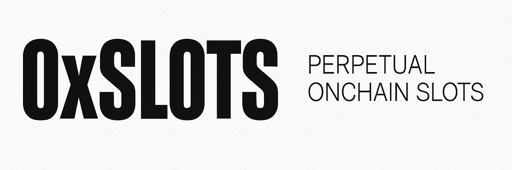

# 0xSlots



**Modular & Immutable Collective Ownership Slots** — Perpetual onchain real estate powered by partial common ownership and Harberger tax. Any ERC-20.

Every slot has a price. Holders self-assess and pay continuous tax. Anyone can buy any slot at the posted price. Resources flow to whoever values them most.

## How it works

1. **Self-assessment** — Slot holders set their own price
2. **Continuous tax** — Pay tax proportional to your assessed price, deducted linearly from a deposit
3. **Always for sale** — Anyone can force-buy at the posted price, instantly
4. **No squatting** — Holding costs money. Insolvent occupants get liquidated

## Architecture

```
0xSlots/
├── apps/
│   ├── contracts/       # Foundry smart contracts (Solidity)
│   └── landing/         # Next.js frontend
├── packages/
│   ├── contracts/       # Published ABIs & addresses (@0xslots/contracts)
│   ├── sdk/             # Type-safe subgraph SDK (@0xslots/sdk)
│   └── subgraph/        # The Graph indexing
```

**Monorepo:** pnpm workspaces + Turborepo

## Contracts

| Contract | Purpose |
|----------|---------|
| **Slot** | Core primitive — ownership, pricing, deposits, tax, liquidation |
| **SlotFactory** | UUPS-upgradeable factory deploying Slots via Beacon proxy |
| **BatchCollector** | Collect tax from multiple slots in one transaction |
| **MetadataModule** | UUPS-upgradeable module storing metadata per slot |
| **ISlotsModule** | Interface for module hooks (onTransfer, onPriceUpdate, onRelease) |

Slots are fully immutable once deployed. Configuration (tax rate, module, manager) is set at creation and optionally mutable by the manager. Modules hook into lifecycle events for extensibility.

**Security:** Audited by K Security (Feb 2026)

## Frontend

Next.js 16 · React 19 · TailwindCSS 4 · wagmi 3 · viem 2 · RainbowKit · shadcn/ui

| Feature | Description |
|---------|-------------|
| **Explorer** | Tabbed dashboard — Recipients, Slots, Modules, Events |
| **Create Slot** | Multi-step stepper with ENS resolution, currency selection, module picker |
| **Slot Detail** | Tabbed view — Details, Activity, Manage. Buy section with deposit slider |
| **EIP-5792** | Atomic batching (approve + buy in one prompt) when wallet supports it |
| **Profile** | Slots as recipient & occupant for connected wallet |
| **Toasts** | Transaction success/error notifications via Sonner |

## NPM Packages

| Package | Version | Description |
|---------|---------|-------------|
| [@0xslots/contracts](https://www.npmjs.com/package/@0xslots/contracts) | [](https://www.npmjs.com/package/@0xslots/contracts) | Contract ABIs and addresses for use with viem |
| [@0xslots/sdk](https://www.npmjs.com/package/@0xslots/sdk) | [](https://www.npmjs.com/package/@0xslots/sdk) | Type-safe SDK for querying subgraph data |

## Deployments

### Base Sepolia (84532) — Testnet v3

| Contract | Address |
|----------|---------|
| SlotFactory | `0x57759A2094cbE24313B826b453d4e7760279f79D` |
| BatchCollector | `0xDE5B9A3ce6Cbca935E33221909fA261F4EfC4c84` |
| MetadataModule | `0x6c5A8A7f061bEd94b1b88CFAd4e1a1a8C5c4e527` |
| Currency | USDC (`0x036CbD53842c5426634e7929541eC2318f3dCF7e`) |

### Arbitrum (42161)

| Contract | Address |
|----------|---------|
| SlotsHub (proxy) | `0x774776d0f693eB7718b67f7938541D5bbB5f92D0` |
| MetadataModule | `0xe96e9105994A8691338eaf0fDc50c02277949521` |
| Currency | [USND](https://www.nerite.org/) |

### Subgraphs

| Network | Endpoint |
|---------|----------|
| Arbitrum | `https://api.studio.thegraph.com/query/958/0-x-slots-arb/version/latest` |
| Base Sepolia | `https://api.studio.thegraph.com/query/958/0-x-slots-base-sepolia/version/latest` |

## Development

```bash
# Install dependencies
pnpm install

# Run frontend
pnpm dev:landing

# Build everything
pnpm build

# Lint & format
pnpm check
pnpm format
```

### Contracts (Foundry)

```bash
cd apps/contracts
forge build
forge test
```

## Built with

Foundry · Solidity · OpenZeppelin · The Graph · Next.js · wagmi · viem · RainbowKit · TailwindCSS · Turborepo

## Links

- [Website](https://0xslots.vercel.app)
- [GitHub](https://github.com/adcommune/0xSlots)

---

*by [adcommune](https://github.com/adcommune)*
