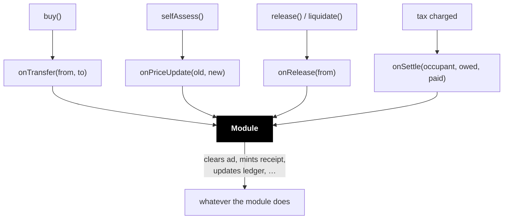

import { Callout } from 'vocs'

# Utility modules

A slot on its own is a position and nothing more. It has a price, an occupant
and a tax — but holding it grants you no rights, because there is nothing
attached to grant.

**The slot is the plot. The module is the crop.**

A module is what makes holding worth anything: the ad that renders, the name
that resolves, the feed you can post to, the door that opens. Without one, a
slot is a well-priced way to own nothing.

## How a module learns what happened

The slot notifies its module as things occur. The module does whatever it likes
with that.

Three of these report **occupancy** — who holds the slot and at what price.
`onSettle` reports **money**: how much tax was actually taken and from whom.

<Callout type="info">
`onSettle` carries both what was *owed* and what was *paid*, and they differ. A
charge is capped by the remaining deposit, so an occupant running dry pays less
than they owe. Anything doing revenue share or contribution accounting must use
`paid` — reconstructing it from price × time computes `owed` and over-credits,
in a way someone can deliberately exploit.
</Callout>

## Modules are fail-open

If a module reverts, runs out of gas, or is simply broken, **the slot carries on
regardless**. The call is gas-capped and its failure is swallowed.

This is the exact opposite of an occupancy policy, and the asymmetry is the
point:

| | Occupancy policy | Utility module |
|---|---|---|
| Answers | may this happen? | this happened |
| On failure | **blocks the action** | **ignored** |
| Can move funds | never | takes a fee from tax |
| Runs on | buy, price update | buy, price update, release, settle |

A rule about who may take your property must be reliable, so a broken policy
stops everything. A feature attached to a slot must never be able to freeze the
money underneath it, so a broken module is skipped.

<Callout type="warning">
That has a consequence worth designing around: a module must never be the
*source of truth* for anything financial. If it misses a call, nothing tells it.
For accounting, read the `TaxPaid` event instead — it always fires, regardless
of what the module did.
</Callout>

## Fees

A module can take a cut of the tax through `feeBps` and `feeRecipient`. It is
skimmed when tax is collected, and the remainder goes to the recipient.

This is how a module author gets paid for building something people want on a
slot they do not own. It is declared by the module itself and visible before
anyone commits.

## Available modules

### Metadata

Attaches arbitrary metadata to a slot — a URI, an image, structured JSON. The
occupant sets it; it is cleared when they leave.

This is the workhorse. Ad slots, profile positions, listings, anything where
holding the slot means "this content shows here".

### Feed post

Lets the occupant post into a feed. Holding the slot is a right to publish.

## Writing one

A module is any contract implementing `ISlotsModule`. There is no registry to
join and no permission to request — pass its address at slot creation.

The factory can mark a module **verified**, which is a curation signal shown in
the explorer. It is not a security boundary: an unverified module works exactly
as well, it just carries no endorsement.

Practical notes:

- Keep hooks cheap. They run inside user transactions under a gas cap.
- Key state by `msg.sender` — one module usually serves many slots, and the
  calling slot is the only trustworthy identifier.
- Never assume a hook arrived. Fail-open means silence is possible.
- `onSettle` fires *mid-transaction*, before the calling operation has finished.
  The slot is in its pre-operation state; treat anything you read as in flux.

## Next

- [Module reference](/reference/modules) — the interface in full
- [Occupancy](/concepts/occupancy) — controlling *when* the slot changes hands
