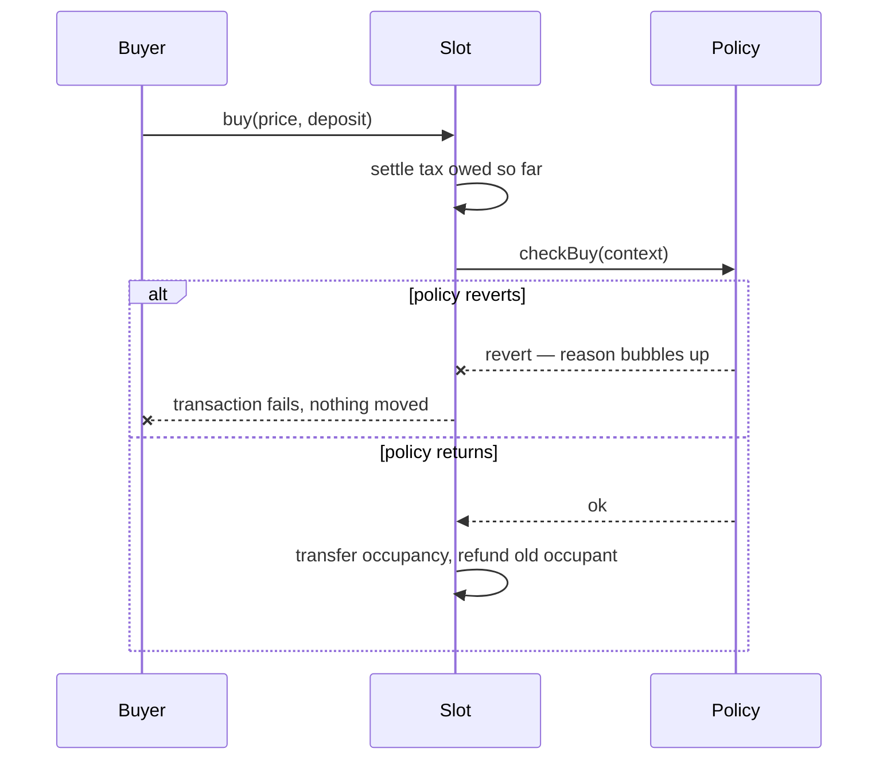

import { Callout } from 'vocs'

# Occupancy

By default a slot can be taken from you at any moment, by anyone willing to pay
your declared price. That is the point — but it is also brutal, and for a lot of
uses it is too brutal.

**Occupancy policies** soften *when* a slot can change hands. They never touch
*what it costs*.

## Why the line is drawn there

Harberger works because the tax and the forced sale pull against each other. Let
a policy change the price and that tension breaks: a rule that lets you buy
below the declared price makes under-declaring profitable, which inverts the
whole mechanism. The tax stops being a truth serum and becomes a fee you dodge.

So a policy gets exactly one power: **say no**.



The policy is asked *before* anything moves, is handed everything it needs by
value, and can only answer by reverting or not. It cannot move funds, change the
price, or redirect the buyer.

<Callout type="warning">
Policies are **fail-closed**. If the policy contract reverts, is broken, or is
not a policy at all, the buy fails. This is the opposite of how modules behave,
and it is deliberate — a rule about who may take your property should never be
skippable because a contract had a bad day.
</Callout>

## What a policy can never do

Two escape hatches are wired around policies entirely:

- **`liquidate()`** — an insolvent occupant can always be removed. No policy is
  consulted. Otherwise a policy could keep someone in a slot they have stopped
  paying for, and the recipient would be stuck with a deadbeat forever.
- **`release()`** — an occupant can always leave. No policy is consulted.
  Otherwise a policy could trap you in a position you no longer want.

Together these mean the worst a bad policy can do is stop *new* people arriving.
It can never strand money or trap a person.

## Available policies

### Minimum tenure

Nobody can buy the occupant out for a fixed period after they take the slot.

The obvious objection is that this suspends forced sale, so under-declaring goes
unpunished. It does not, for two reasons the policy enforces:

- The whole window's tax must be escrowed **up front**. A dishonest price is
  paid for in advance.
- The occupant **cannot cut their price** while protected. So they cannot
  declare high to look serious, then drop it once safe.

The punishment for a dishonest price is not removed. It is deferred to the end
of the window.

Use it when being sniped mid-task would ruin the point: a renter part-way
through a piece of work, a campaign that needs to run for a week, anything where
losing the slot instantly makes it worthless.

### Minimum price

A reserve. Nobody may declare below a floor on this slot.

Useful when a slot has a known baseline worth and a race to the bottom would be
worse than it sitting empty. The floor is bound to a specific currency, so a
policy for one token cannot be pointed at a slot denominated in another.

### Queue priority

When a slot frees up it goes to whoever queued first, rather than to whoever is
fastest.

This is the one that matters if you care about bots. Without it, a slot going
vacant is a latency race and the best-connected party always wins. Joining a
queue is a separate, uncontested action, so speed stops deciding.

It applies **only while the slot is vacant**. Buying out a live occupant is
untouched — the queue allocates what nobody holds, it does not suspend forced
sale.

## Verifying a policy is what it claims

Any contract can implement the interface and any contract can *say* it enforces
a 7-day tenure. Reading a policy's own getters proves nothing.

Every policy kind ships with a factory that deploys it at a **CREATE2 address
derived from its terms**. Because CREATE2 binds an address to the deployer, the
init code *and* the salt, only the genuine policy for those exact terms can
occupy that address. Verification is therefore one call:

```solidity
// Did you make this?
factory.verify(policy) // → bool
```

Reading the terms off an untrusted address is safe precisely because it is the
comparison, not the read, that is trusted.

<Callout type="info">
This is why the explorer can name a policy it has never seen before. It does not
consult a hardcoded list — it asks each known factory whether the address is
theirs, and formats the answer. Adding a new policy kind means deploying a
factory, not editing every client.
</Callout>

## Choosing

| You want | Use |
|---|---|
| Plain Harberger, maximum contestability | no policy |
| Holders to get uninterrupted time | Minimum tenure |
| A floor under the price | Minimum price |
| Fair allocation when a slot frees up | Queue priority |

No policy is the default, and it is a real choice rather than an absence of one.

## Next

- [Utility modules](/concepts/modules) — what the slot is actually *for*
- [Policy reference](/reference/policies) — interfaces and addresses
