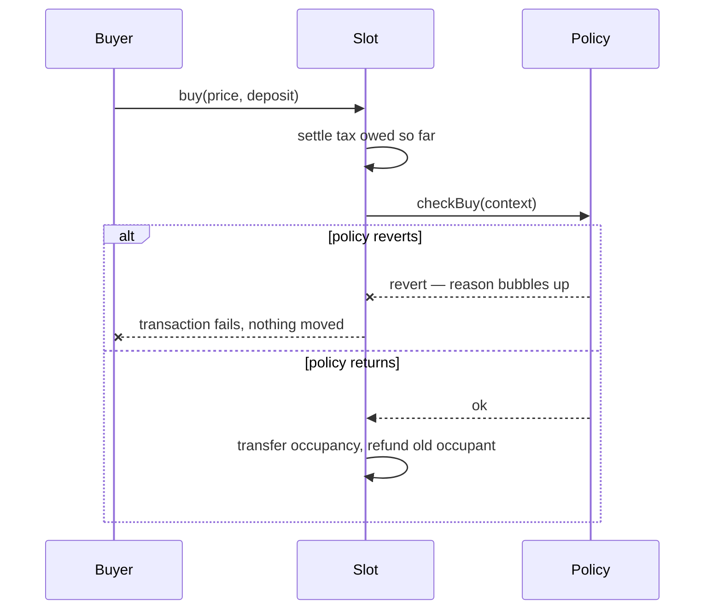

import { Callout } from 'vocs'

# Occupancy

By default a slot can be taken from you at any moment, by anyone paying your
declared price. An **occupancy policy** softens *when* that can happen. It never
changes *what it costs*.

Set one at creation, or leave it empty for plain instant buy.

## Choosing one

| You want | Use |
|---|---|
| Maximum contestability | no policy |
| Holders get uninterrupted time | **Minimum tenure** |
| A floor under the price | **Minimum price** |
| Fair allocation when a slot frees up | **Queue priority** |

No policy is the default, and it is a real choice rather than an absence of one.

## Minimum tenure

Nobody can buy the occupant out for a fixed period after they take the slot.

Use it when being sniped mid-task would ruin the point — a renter part-way
through a piece of work, a campaign that needs to run for a week, anything where
losing the slot instantly makes it worthless.

Two conditions keep it honest:

- The whole window's tax is escrowed **up front**.
- The occupant **cannot cut their price** while protected.

So a dishonest price is paid for in advance, and cannot be dropped once safe.
The punishment is deferred, not removed.

## Minimum price

A reserve. Nobody may declare below a floor.

Useful when a slot has a known baseline worth and a race to the bottom is worse
than it sitting empty. The floor is bound to a specific currency, so a policy
for one token cannot be pointed at a slot denominated in another.

## Queue priority

When a slot frees up it goes to whoever queued first, rather than to whoever is
fastest.

This is the one that matters if you care about bots. Without it, a slot going
vacant is a latency race and the best-connected party wins. Joining a queue is a
separate, uncontested action, so speed stops deciding.

Applies **only while the slot is vacant**. Buying out a live occupant is
untouched.

## Verifying a policy

Any contract can implement the interface and claim to enforce a 7-day tenure.
Reading its own getters proves nothing.

Every policy kind ships with a factory that deploys it at a CREATE2 address
derived from its terms, so verification is one call:

```solidity
factory.verify(policy) // → bool
```

CREATE2 binds an address to the deployer, the init code *and* the salt, so only
the genuine policy for those exact terms can sit there.

<Callout type="info">
This is why the explorer can name a policy it has never seen. It asks each known
factory "did you make this?" rather than consulting a hardcoded list. Adding a
policy kind means deploying a factory, not editing every client.
</Callout>

---

## Design notes

### Why a policy may only say "no"

A policy gets exactly one power: revert. It cannot move funds, change the price,
or redirect the buyer.

Harberger works because the tax and the forced sale pull against each other. Let
a policy touch the price and that breaks — a rule that lets you buy below the
declared price makes under-declaring profitable, which inverts the mechanism.
The tax stops being a truth serum and becomes a fee you dodge.

So policies control timing. Never price.

### Policies are fail-closed



If the policy reverts, is broken, or is not a policy at all, **the buy fails**.
This is the opposite of how [modules](/concepts/modules) behave, and it is
deliberate: a rule about who may take your property should never be skippable
because a contract had a bad day.

### What no policy can do

Two escape hatches bypass policies entirely:

- **`liquidate()`** — an insolvent occupant can always be removed. Otherwise a
  policy could keep someone in a slot they have stopped paying for.
- **`release()`** — an occupant can always leave. Otherwise a policy could trap
  you in a position you no longer want.

The worst a bad policy can do is stop *new* people arriving. It can never strand
money or trap a person.

## Next

- [Utility modules](/concepts/modules) — what the slot is actually for
- [Policy reference](/reference/policies) — interfaces and addresses
