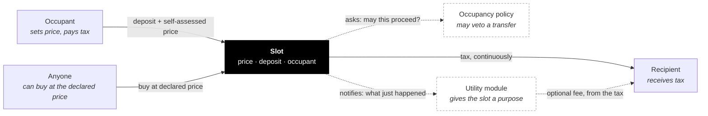
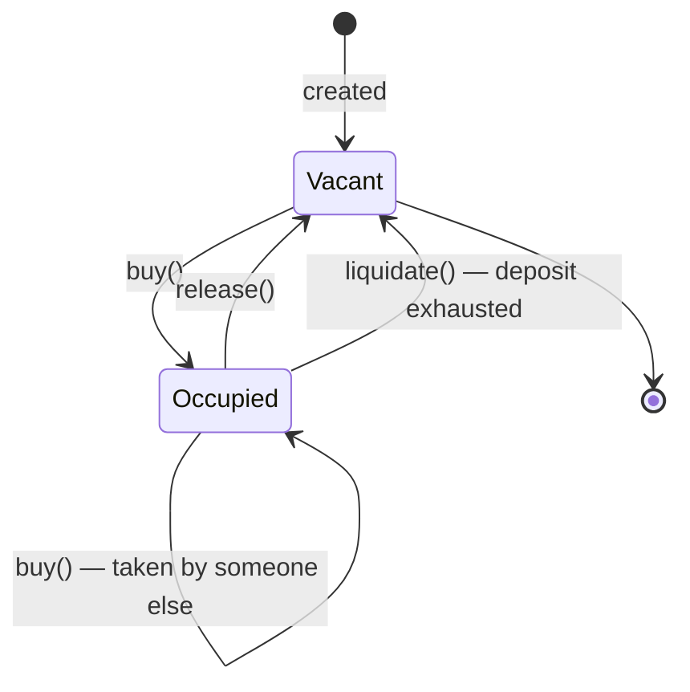

import { Callout } from 'vocs'

# How a slot works

A slot is one smart contract holding one position. It has an **occupant** who
holds it, a **price** the occupant sets themselves, and a **recipient** who
receives the tax.

Three rules, and they only work together:

1. **You set your own price.** Whatever you declare, you declare publicly.
2. **You pay tax on that price, continuously.** Charged per second against a
   deposit you keep topped up.
3. **Anyone can buy it from you at that price, at any time.** No negotiation,
   no approval from you.

Rule 2 punishes declaring too high. Rule 3 punishes declaring too low. Between
them there is only one comfortable answer: declare what it is actually worth to
you.

<Callout type="info">
Remove any one rule and the other two stop working. A price with no tax is a
bluff. A tax with no forced sale is just rent. Forced sale with no
self-assessment needs someone else to set the price — which is the problem the
whole design exists to avoid.
</Callout>

## The parts

Solid lines move value. Dashed lines are optional and move only information —
except the module fee, which is a cut of tax the recipient would otherwise get.

| Part | Required | What it does |
|---|---|---|
| **Occupant** | — | Holds the slot, sets the price, pays the tax |
| **Recipient** | yes | Receives the tax. Fixed at creation, never changes |
| **Occupancy policy** | no | Can veto a buy or a price change. Never moves money |
| **Utility module** | no | Gives the slot a purpose — ads, naming, content, access |
| **Manager** | no | May change what was declared changeable at creation |

## Money in the slot

Two balances, and confusing them is the most common mistake:

- **Price** — what you say the slot is worth. Anyone may pay this to take it
  from you. It is not held by the contract; it is a standing offer.
- **Deposit** — real tokens you put in, which tax is drawn from. When it runs
  out you are insolvent and can be liquidated.

`minDepositSeconds` sets how much deposit a buy must bring: enough to cover that
many seconds of tax at the declared price. It stops someone taking a slot with a
huge price and no means to pay for it.

## Lifecycle

Tax accrues per second while occupied. Nothing runs on a timer — the contract
settles whatever is owed at the start of every interaction, so the numbers are
correct whenever anyone looks.

`collect()` pushes accrued tax to the recipient and is **permissionless**:
anyone can trigger it, including the recipient.

## Liquidation

When the deposit hits zero the occupant is insolvent and anyone may call
`liquidate()`. The slot goes vacant and the caller earns
`liquidationBountyBps` — taken **from the collected tax**, not from anyone's
deposit — as payment for doing the housekeeping.

<Callout type="warning">
No occupancy policy can prevent liquidation. `liquidate()` and `release()` never
consult one. A policy can delay who takes a slot and when; it can never keep a
slot occupied by someone who has stopped paying, and it can never trap an
occupant who wants to leave.
</Callout>

## Roles

| Role | Set | Can |
|---|---|---|
| **Occupant** | by buying | Set price, top up, withdraw surplus, release |
| **Operator** | by the occupant | Act for the occupant — `setOperator` delegates price changes without handing over the slot |
| **Recipient** | at creation, forever | Receive tax. Nothing else — a recipient has no power over the slot |
| **Manager** | at creation | Propose changes, but only to what was declared mutable |

A slot is immutable by default. Each of `mutableTax`, `mutableModule` and
`mutablePolicy` is a separate promise made at creation, and a manager only
exists if at least one is true.

<Callout type="info">
The three flags are deliberately independent. You might reasonably want a
swappable ad module on occupancy terms that can never change. Conflating them
would make that inexpressible — and would let a slot advertising "the module can
change" quietly also reserve the right to change who is allowed to take it.
</Callout>

## Next

- [Occupancy](/concepts/occupancy) — why a slot might refuse a sale, and on what terms
- [Utility modules](/concepts/modules) — how a slot gets a purpose
- [Slot reference](/reference/slot) — the full contract API
