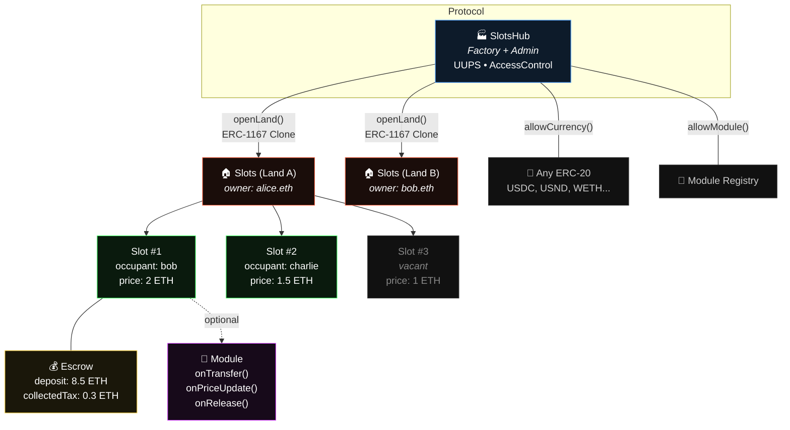
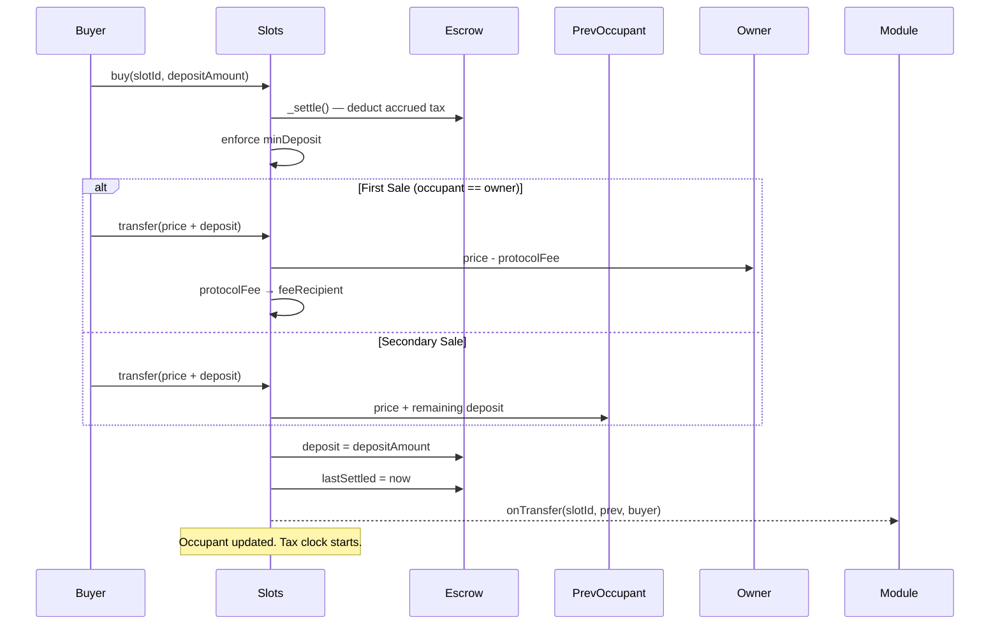
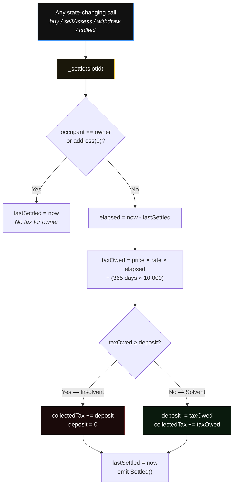
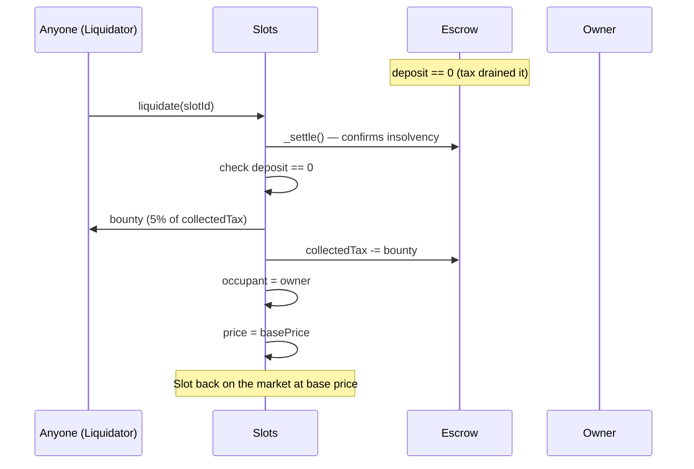
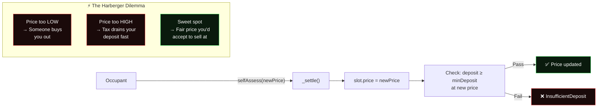
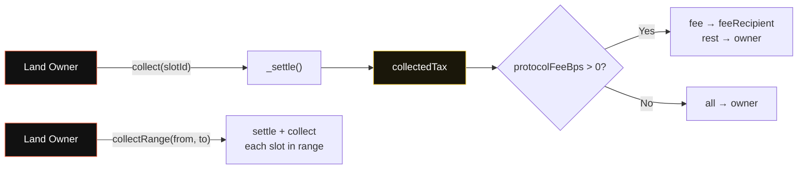
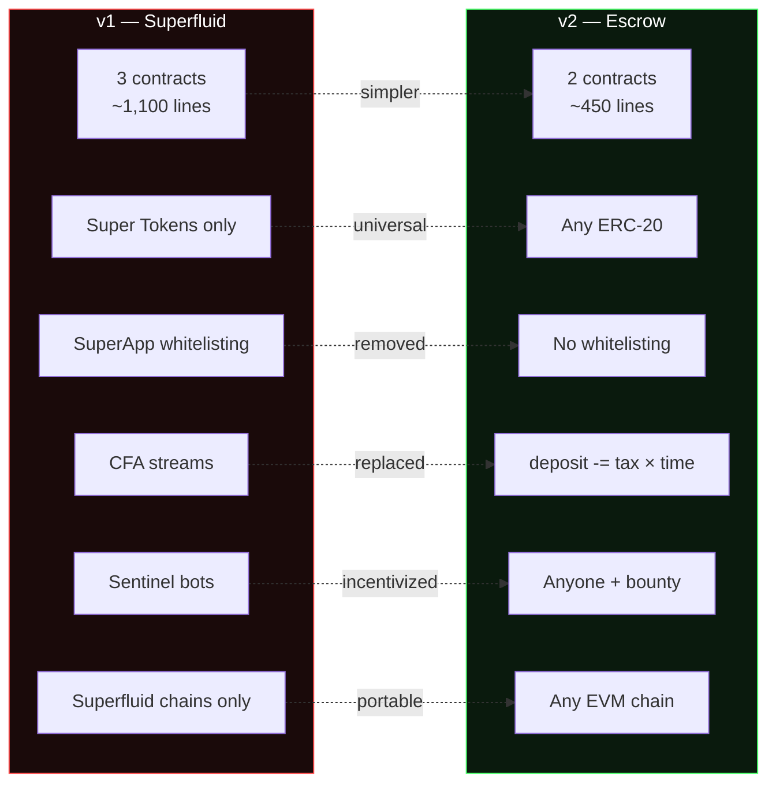
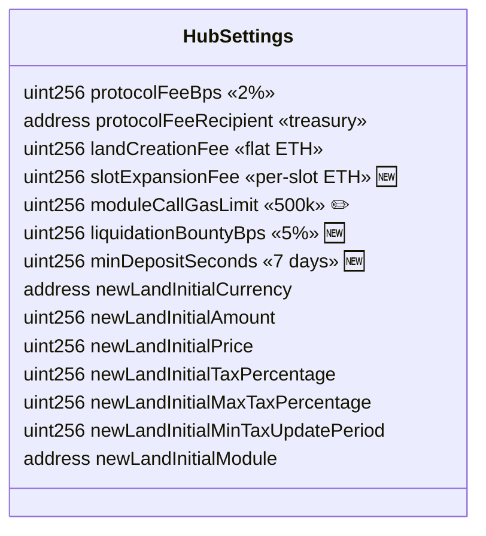

# 0xSlots v2 Architecture

## Contract Hierarchy

## Buy Flow

## Tax Settlement (on every state change)

## Liquidation Flow

## Self-Assess + Harberger Dilemma

## Tax Collection

## v1 → v2 Comparison

## Hub Settings

