# 0xSlots v2 Architecture

## Contract Hierarchy

```mermaid
graph TD
    subgraph Protocol
        HUB["🏭 SlotsHub<br/><i>Factory + Admin</i><br/>UUPS • AccessControl"]
    end

    HUB -->|"openLand()<br/>ERC-1167 Clone"| LAND1["🏠 Slots (Land A)<br/><i>owner: alice.eth</i>"]
    HUB -->|"openLand()<br/>ERC-1167 Clone"| LAND2["🏠 Slots (Land B)<br/><i>owner: bob.eth</i>"]

    LAND1 --> S1["Slot #1<br/>occupant: bob<br/>price: 2 ETH"]
    LAND1 --> S2["Slot #2<br/>occupant: charlie<br/>price: 1.5 ETH"]
    LAND1 --> S3["Slot #3<br/><i>vacant</i><br/>price: 1 ETH"]

    S1 --- E1["💰 Escrow<br/>deposit: 8.5 ETH<br/>collectedTax: 0.3 ETH"]
    S1 -.->|"optional"| M1["🔌 Module<br/>onTransfer()<br/>onPriceUpdate()<br/>onRelease()"]

    HUB ---|"allowCurrency()"| CUR["💎 Any ERC-20<br/>USDC, USND, WETH..."]
    HUB ---|"allowModule()"| MOD["🔌 Module Registry"]

    style HUB fill:#0d1b2a,stroke:#4a9eff,color:#fff
    style LAND1 fill:#1a0d0a,stroke:#ff6b4a,color:#fff
    style LAND2 fill:#1a0d0a,stroke:#ff6b4a,color:#fff
    style S1 fill:#0a1a0d,stroke:#4aff6b,color:#fff
    style S2 fill:#0a1a0d,stroke:#4aff6b,color:#fff
    style S3 fill:#111,stroke:#333,color:#888
    style E1 fill:#1a170a,stroke:#ffd74a,color:#fff
    style M1 fill:#170a1a,stroke:#d74aff,color:#fff
    style CUR fill:#111,stroke:#333,color:#ccc
    style MOD fill:#111,stroke:#333,color:#ccc
```

## Buy Flow

```mermaid
sequenceDiagram
    participant Buyer
    participant Slots
    participant Escrow
    participant PrevOccupant
    participant Owner
    participant Module

    Buyer->>Slots: buy(slotId, depositAmount)
    Slots->>Escrow: _settle() — deduct accrued tax
    Slots->>Slots: enforce minDeposit

    alt First Sale (occupant == owner)
        Buyer->>Slots: transfer(price + deposit)
        Slots->>Owner: price - protocolFee
        Slots->>Slots: protocolFee → feeRecipient
    else Secondary Sale
        Buyer->>Slots: transfer(price + deposit)
        Slots->>PrevOccupant: price + remaining deposit
    end

    Slots->>Escrow: deposit = depositAmount
    Slots->>Escrow: lastSettled = now
    Slots-->>Module: onTransfer(slotId, prev, buyer)

    Note over Slots: Occupant updated. Tax clock starts.
```

## Tax Settlement (on every state change)

```mermaid
flowchart TD
    A["Any state-changing call<br/><i>buy / selfAssess / withdraw / collect</i>"] --> B["_settle(slotId)"]
    B --> C{"occupant == owner<br/>or address(0)?"}
    C -->|Yes| D["lastSettled = now<br/><i>No tax for owner</i>"]
    C -->|No| E["elapsed = now - lastSettled"]
    E --> F["taxOwed = price × rate × elapsed<br/>÷ (365 days × 10,000)"]
    F --> G{"taxOwed ≥ deposit?"}
    G -->|Yes — Insolvent| H["collectedTax += deposit<br/>deposit = 0"]
    G -->|No — Solvent| I["deposit -= taxOwed<br/>collectedTax += taxOwed"]
    H --> J["lastSettled = now<br/>emit Settled()"]
    I --> J

    style A fill:#111,stroke:#4a9eff,color:#fff
    style B fill:#1a170a,stroke:#ffd74a,color:#fff
    style H fill:#1a0a0a,stroke:#ff4a4a,color:#fff
    style I fill:#0a1a0d,stroke:#4aff6b,color:#fff
```

## Liquidation Flow

```mermaid
sequenceDiagram
    participant Anyone as Anyone (Liquidator)
    participant Slots
    participant Escrow
    participant Owner

    Note over Escrow: deposit == 0 (tax drained it)

    Anyone->>Slots: liquidate(slotId)
    Slots->>Escrow: _settle() — confirms insolvency
    Slots->>Slots: check deposit == 0

    Slots->>Anyone: bounty (5% of collectedTax)
    Slots->>Escrow: collectedTax -= bounty

    Slots->>Slots: occupant = owner
    Slots->>Slots: price = basePrice

    Note over Slots: Slot back on the market at base price
```

## Self-Assess + Harberger Dilemma

## Tax Collection

## v1 → v2 Comparison

```mermaid
graph LR
    subgraph V1["v1 — Superfluid"]
        V1A["3 contracts<br/>~1,100 lines"]
        V1B["Super Tokens only"]
        V1C["SuperApp whitelisting"]
        V1D["CFA streams"]
        V1E["Sentinel bots"]
        V1F["Superfluid chains only"]
    end

    subgraph V2["v2 — Escrow"]
        V2A["2 contracts<br/>~450 lines"]
        V2B["Any ERC-20"]
        V2C["No whitelisting"]
        V2D["deposit -= tax × time"]
        V2E["Anyone + bounty"]
        V2F["Any EVM chain"]
    end

    V1A -.->|"simpler"| V2A
    V1B -.->|"universal"| V2B
    V1C -.->|"removed"| V2C
    V1D -.->|"replaced"| V2D
    V1E -.->|"incentivized"| V2E
    V1F -.->|"portable"| V2F

    style V1 fill:#1a0a0a,stroke:#ff4a4a,color:#fff
    style V2 fill:#0a1a0d,stroke:#4aff6b,color:#fff
```

## Hub Settings

```mermaid
classDiagram
    class HubSettings {
        uint256 protocolFeeBps          «2%»
        address protocolFeeRecipient    «treasury»
        uint256 landCreationFee         «flat ETH»
        uint256 slotExpansionFee        «per-slot ETH» 🆕
        uint256 moduleCallGasLimit      «500k» ✏️
        uint256 liquidationBountyBps    «5%» 🆕
        uint256 minDepositSeconds       «7 days» 🆕
        address newLandInitialCurrency
        uint256 newLandInitialAmount
        uint256 newLandInitialPrice
        uint256 newLandInitialTaxPercentage
        uint256 newLandInitialMaxTaxPercentage
        uint256 newLandInitialMinTaxUpdatePeriod
        address newLandInitialModule
    }
```

